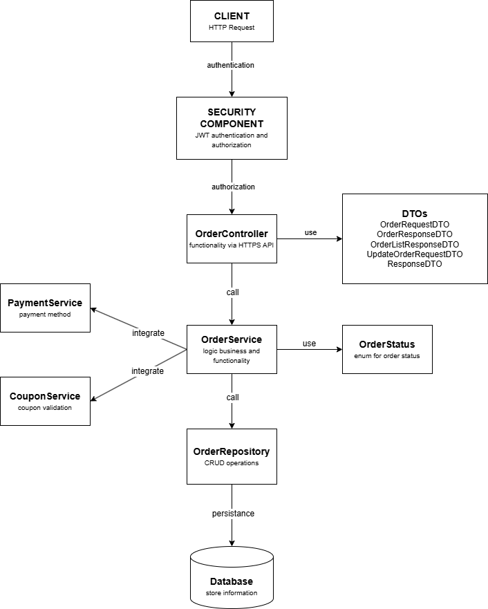
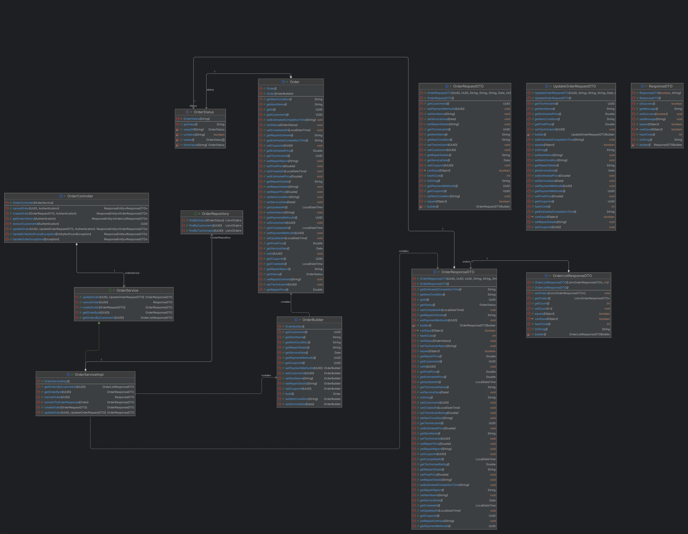

# advprog-module12
Module 12 Advanced Programming 2024/2025

Software Architecture

**Kelompok A16**
- Ghina Nabila Gunawan - 2206825914
- Deanita Sekar Kinasih - 2306229405
- Peter Putra Lesmana - 2306152361
- Kaindra Rizq Sachio - 2306274964
- Muhammad Fazil Tirtana - 2306274983
- Haliza Nafiah Syakira Arfa - 2306211401

## Deliverable G.1

### Container Diagram

### Context Diagram

### Deployment Diagram

## Deliverable G.2

### Future Container

### Future Context

## Deliverable G.3

### Risk Analysis untuk Arsitektur yang Diperbarui

### a. Risiko Skalabilitas
Setiap service memiliki database PostgreSQL terpisah. Dalam implementasi berbasis Spring Boot, masing-masing service secara default membuka sejumlah koneksi aktif ke databasenya melalui connection pool. Ketika jumlah layanan bertambah dan permintaan meningkat, total koneksi ke semua database dapat melonjak dan menyebabkan saturasi resource, baik di sisi aplikasi maupun PostgreSQL. Akibatnya, sistem bisa mengalami timeout, bottleneck pada query, bahkan kegagalan layanan.

### b. Risiko Keamanan
Layanan seperti ReviewService dan CouponService menerima input berupa teks bebas dari pengguna. Jika input tersebut disimpan tanpa sanitasi dan kemudian ditampilkan kembali ke pengguna lain melalui SPA, maka sistem menjadi rentan terhadap serangan Stored XSS. Hal ini sangat berisiko terutama jika SPA tidak menerapkan penyandian (escape) pada saat render konten.

## Deliverable Individual

**Fitur Melakukan Pemesanan Jasa Perbaikan Barang**

Component Diagram

Code Diagram

