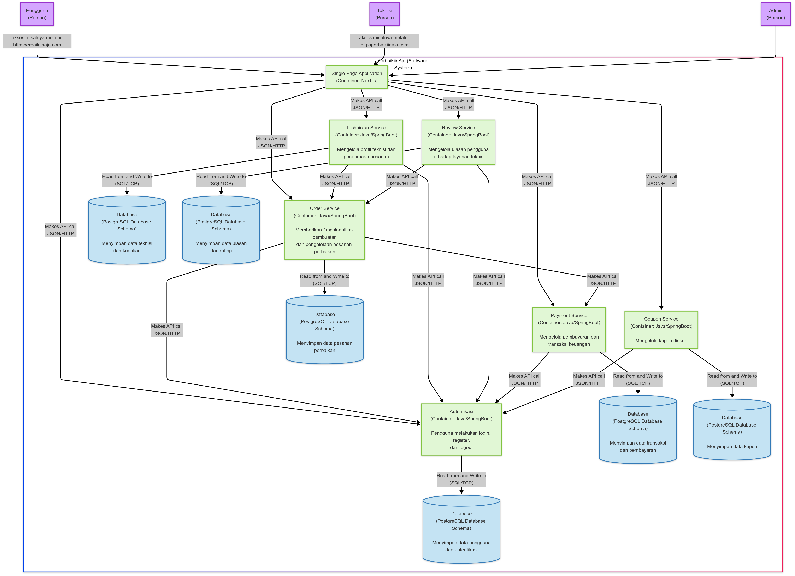
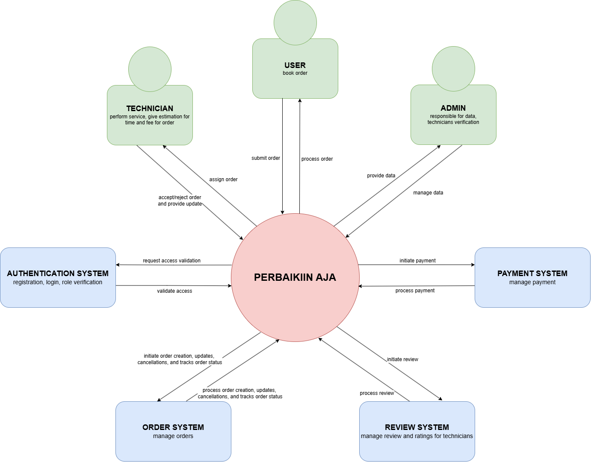
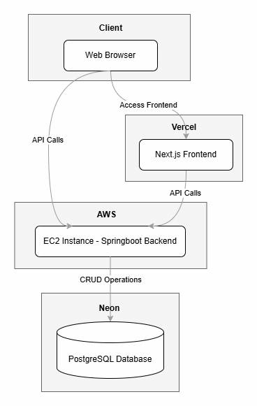
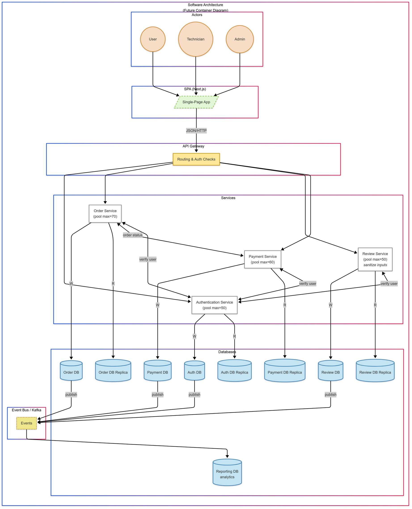
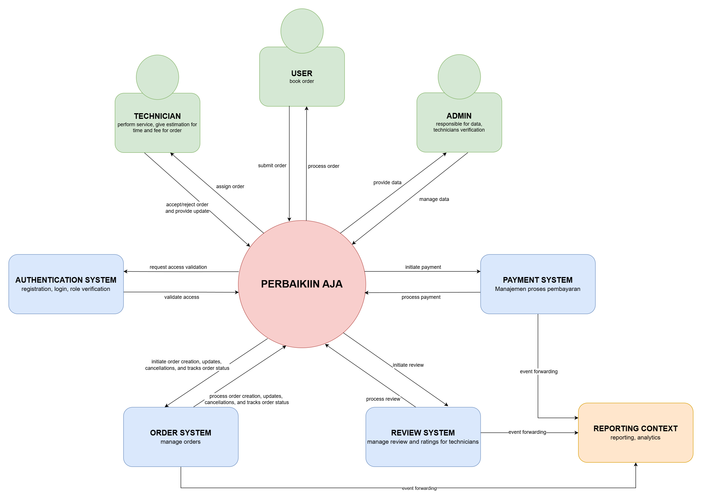

# advprog-module12
Module 12 Advanced Programming 2024/2025

Software Architecture

**Kelompok A16**
- Ghina Nabila Gunawan - 2206825914
- Deanita Sekar Kinasih - 2306229405
- Peter Putra Lesmana - 2306152361
- Kaindra Rizq Sachio - 2306274964
- Muhammad Fazil Tirtana - 2306274983
- Haliza Nafiah Syakira Arfa - 2306211401

## Deliverable G.1

### Container Diagram

### Context Diagram

### Deployment Diagram

## Deliverable G.2

### Future Container

### Future Context

## Deliverable G.3

### Risk Analysis untuk Arsitektur yang Diperbarui

### a. Risiko Skalabilitas

### b. Risiko Keamanan

## Deliverable Individual